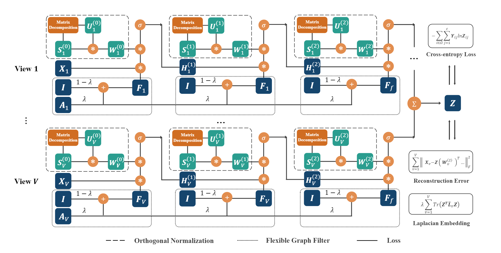

[python-img]: https://img.shields.io/github/languages/top/ZhihaoWu99/IMvGCN?color=lightgrey
[stars-img]: https://img.shields.io/github/stars/ZhihaoWu99/IMvGCN?color=yellow
[stars-url]: https://github.com/ZhihaoWu99/IMvGCN/stargazers
[visitors-img]: https://visitor-badge.glitch.me/badge?page_id=ZhihaoWu99/IMvGCN
[adgc-url]: https://github.com/ZhihaoWu99/IMvGCN

Interpretable Graph Convolutional Network for Multi-view Semi-supervised Learning
====


## Paper

[![Made with Python][python-img]][adgc-url]
[![GitHub stars][stars-img]][stars-url]
[![visitors][visitors-img]][adgc-url]

This is the Pytorch implementation of IMvGCN proposed in our paper:

Zhihao Wu, Xincan Lin, Zhenghong Lin, Zhaoliang Chen, Yang Bai and Shiping Wang*, [Interpretable Graph Convolutional Network for Multi-view Semi-supervised Learning](https://ieeexplore.ieee.org/abstract/document/10080867), IEEE Transactions on Multimedia.



## Requirement

  * Python == 3.9.12
  * PyTorch == 1.11.0
  * Numpy == 1.21.5
  * Scikit-learn == 1.1.0
  * Scipy == 1.8.0
  * Texttable == 1.6.4
  * Tqdm == 4.64.0

## Usage

```
python main.py
```

  * --device: gpu number or 'cpu'.
  * --path: path of datasets.
  * --dataset: name of datasets.
  * --seed: random seed.
  * --fix_seed: fix the seed or not.
  * --n_repeated: number of repeat times.
  * --lr: learning rate.
  * --weight_decay: weight decay.
  * --ratio: label ratio.
  * --num_epoch: number of training epochs.
  * --Lambda: hyperparameter $\lambda$.
  * --alpha: hyperparameter $\alpha$.

All the configs are set as default, so you only need to set dataset.
For example:

 ```
 python main.py --dataset 3Sources
 ```

## Dataset

Please unzip the datasets folders first.

Saved in ./data/datasets/datasets.7z

*Note: You can run construct_lp.py to generate laplacian matrices, and data splitting function can be found in utils.py. Please feel free to email me for the four large datasets.*

## Reference

```
@article{10080867,
  author={Wu, Zhihao and Lin, Xincan and Lin, Zhenghong and Chen, Zhaoliang and Bai, Yang and Wang, Shiping},
  journal={IEEE Transactions on Multimedia}, 
  title={Interpretable Graph Convolutional Network for Multi-View Semi-Supervised Learning}, 
  year={2023},
  pages={1-14},
  doi={10.1109/TMM.2023.3260649}}
```
